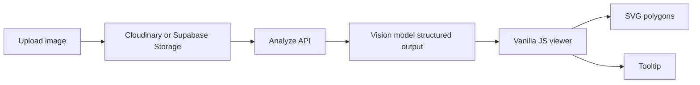

# Floor plan viewer (Vite + vanilla JS)

Implements the **Production floor-plan viewer** plan: **Vite**, **vanilla ES modules**, **plain CSS** (no Tailwind/React/TS required), **SVG** overlay with a pixel-based `viewBox="0 0 naturalWidth naturalHeight"` while JSON stays normalized `0–1`, **letterbox-aware** pointer mapping + **ray-casting** hit tests ([`src/lib/geometry.js`](src/lib/geometry.js)), zoom/pan/fullscreen, premium tooltip.

## Quick start

```bash
npm install
npm start
```

Open `http://127.0.0.1:5173`. **Load sample JSON** loads [`public/fixtures/sample-plan.json`](public/fixtures/sample-plan.json) (rooms-only v1). **Open image** and pick a matching floor plan to see overlays line up.

Phase 2 sample (catalog + sprites): [`public/fixtures/sample-plan-phase2.json`](public/fixtures/sample-plan-phase2.json) — swap the fetch path in [`src/viewer/floorPlanViewer.js`](src/viewer/floorPlanViewer.js) or merge data as needed.

## Architecture



v1 focuses on **rooms**; the editable **furniture** layer is composed when `furniture` / `furniture_catalog` exist in JSON. Use **Export JSON** after moving/replacing furniture to download the current edited analysis.

## Layout (plan)

| Path | Role |
|------|------|
| [`src/main.js`](src/main.js) | Bootstrap |
| [`src/viewer/floorPlanViewer.js`](src/viewer/floorPlanViewer.js) | State, pan/zoom, ray-cast hover |
| [`src/viewer/roomOverlay.js`](src/viewer/roomOverlay.js) | Room polygons |
| [`src/viewer/furnitureLayer.js`](src/viewer/furnitureLayer.js) | Phase 2 sprites |
| [`src/viewer/tooltip.js`](src/viewer/tooltip.js) | Tooltip copy |
| [`src/viewer/toolbar.js`](src/viewer/toolbar.js) | Toolbar UI |
| [`src/upload/uploadDropzone.js`](src/upload/uploadDropzone.js) | File input wiring |
| [`src/lib/coordinates.js`](src/lib/coordinates.js) | Letterbox → normalized |
| [`src/lib/geometry.js`](src/lib/geometry.js) | `pointInPolygon`, bbox |
| [`src/services/supabase.js`](src/services/supabase.js) | Storage upload (optional) |
| [`supabase/migrations/`](supabase/migrations/) | `furniture_catalog`, `floor_plans` |

Copy [`.env.example`](.env.example) to `.env` to show **Upload plan (Supabase)** (requires bucket `floor-plans`). **Cloudinary** can stay optional (see migration `002`).

## Local vision (LM Studio)

After **Open image**, the app calls your model automatically if env is set.

1. Start LM Studio with the OpenAI-compatible server (use the URL it shows, e.g. `http://10.212.228.25:1234`).
2. Run `npm start` from the workspace root or from this folder. The Flask app serves both the UI and `/api/analyze` on `http://127.0.0.1:5173`.
3. **Model and base URL** are read from [`lm_studio.json`](lm_studio.json) (and optional gitignored `lm_studio.local.json`) first, then from `LM_STUDIO_URL` / `LM_STUDIO_MODEL` if a key is missing in those files. That way an old `set LM_STUDIO_MODEL=...` in your shell cannot override the project after you edit the JSON. The toolbar also shows the model name the server is using.

If LM Studio returns **"Model does not support images"**, switch `lm_studio_model` to a **vision / multimodal** model in LM Studio (for example one that explicitly accepts image input there). `qwen/qwen3.5-9b` may be text-only depending on how it is loaded.

```bash
set LM_STUDIO_URL=http://10.212.228.25:1234/v1
set LM_STUDIO_MODEL=qwen/qwen3.5-9b
npm run analyze-server
```

Then set `VITE_ANALYZE_API=http://127.0.0.1:8787` in `.env.local` and **remove or comment out** `VITE_LM_STUDIO_URL` so the app uses the proxy.

Use **Analyze LLM** to re-run extraction on the current file without re-uploading.

## Analyze API (optional)

Not required for the static fixture UI. To hook LM Studio locally:

```bash
npm run analyze-server
```

See [`server.mjs`](server.mjs) / [`app.py`](app.py).

## Build

```bash
npm run build
npm run preview
```
