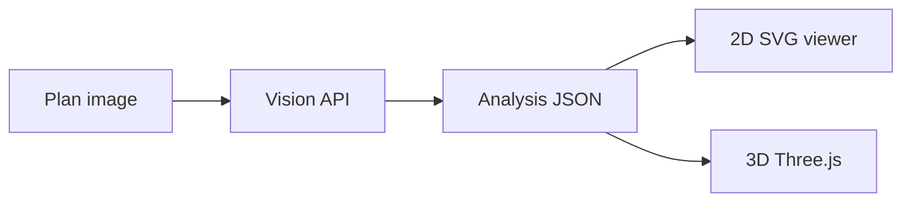

# Floor plan viewer

Vite + vanilla JS app: **2D SVG floor plans** from vision JSON, plus **realistic 3D** (Three.js r184) for any room shape in the analysis.

## Features

### 2D

- Pan, zoom, fullscreen
- Room polygons, walls, doors/windows (when present in JSON)
- Calibration / scale (meters from reference segments)
- Furniture drag, rotate, catalog **Replace with**, sofa color
- Geometry editor: draw rooms, measure, undo
- Tooltips with room dimensions and area (when calibrated)
- Export JSON after edits

### Realistic 3D

Toggle **Realistic 3D** in the toolbar.

| Control | Behavior |
|---------|----------|
| **Dollhouse** | Angled overview of full plan |
| **Top view** | Orthographic-style top-down |
| **Side views** | Click a room floor → 3 elevation thumbnails for that room |
| **Move** | Drag furniture on floor; snaps to bounds and other pieces; updates `furniture[].x/y` in memory |

Rendering (from IKEA-style reference, adapted to AI polygons):

- ACES tone mapping, soft shadows
- Procedural floor/wall textures per room `flooring`
- Spot lights scaled by room area (1 / 2 / 4 per room)
- Glass window on longest wall edge per room
- Procedural sofa / bed / table shapes sized from catalog mm fields

Not in 3D yet: Bloom, real-time SSAO, GLB models, price panel, save 3D moves to Supabase.

## Quick start

```bash
npm install
cp .env.example .env
npm start
```

Open http://127.0.0.1:5173

- **Load sample JSON** — [`public/fixtures/sample-plan.json`](public/fixtures/sample-plan.json) (multi-room apartment)
- **Open image** — then vision runs if API keys are configured

Phase 2 fixture (catalog URLs in JSON): [`public/fixtures/sample-plan-phase2.json`](public/fixtures/sample-plan-phase2.json)

## Environment

Copy [`.env.example`](.env.example) to `.env` / `.env.local`.

| Variable | Purpose |
|----------|---------|
| `VITE_SUPABASE_URL` / `VITE_SUPABASE_ANON_KEY` | Catalog + optional plan upload |
| `VITE_SUPABASE_STORAGE=1` | Enable **Upload plan (Supabase)** |
| `VITE_GEMINI_API_KEY` | Gemini vision |
| `VITE_FIREWORKS_API_KEY` | Fireworks Kimi vision |
| `LM_STUDIO_URL` / `LM_STUDIO_MODEL` | Local vision (see `lm_studio.json`) |
| `VITE_ANALYZE_API` | Proxy analyze server URL |

Supabase catalog table: `shearling_catalog` (column names may be CSV-style on remote; map or add a view for `product_code`, `width_mm`, etc.).

## Architecture



### Key modules

| Path | Role |
|------|------|
| [`src/viewer/floorPlanViewer.js`](src/viewer/floorPlanViewer.js) | App state, 2D/3D toggle, tools |
| [`src/viewer/plan3dViewer.js`](src/viewer/plan3dViewer.js) | 3D scene build, side views, room pick |
| [`src/viewer/plan3dMaterials.js`](src/viewer/plan3dMaterials.js) | Floor/wall/fabric materials |
| [`src/viewer/plan3dLighting.js`](src/viewer/plan3dLighting.js) | Lights + ceiling discs |
| [`src/viewer/plan3dCamera.js`](src/viewer/plan3dCamera.js) | Dollhouse / top / side cameras |
| [`src/viewer/plan3dInteraction.js`](src/viewer/plan3dInteraction.js) | Pick, hover tooltip, move mode |
| [`src/viewer/plan3dMove.js`](src/viewer/plan3dMove.js) | World position + room constraints |
| [`src/viewer/svgRenderer.js`](src/viewer/svgRenderer.js) | 2D overlay |
| [`src/services/supabase.js`](src/services/supabase.js) | Storage + catalog fetch |
| [`supabase/migrations/`](supabase/migrations/) | Schema (`003` = projects / placed_furniture) |

## Local vision (LM Studio)

1. Start LM Studio OpenAI-compatible server.
2. Set model in [`lm_studio.json`](lm_studio.json) (vision-capable model).
3. `npm start` — analyze runs after **Open image** when configured.

Or run proxy:

```bash
npm run analyze-server
```

Set `VITE_ANALYZE_API=http://127.0.0.1:8787` in `.env.local`.

## Scripts

| Command | Description |
|---------|-------------|
| `npm start` | Build + run Flask (`app.py`) on port 5173 |
| `npm run build` | Production build to `dist/` |
| `npm run preview` | Preview production build |
| `npm run analyze-server` | Standalone analyze proxy (`server.mjs`) |

## Planned polish

- Baked `aoMap` on floor materials (cheap contact shadows, no SSAO)
- Catalog `image_url` / GLB in 3D
- Budget filter before furniture placement
- Apply Supabase `003` + save/load projects

## Build

```bash
npm run build
npm run preview
```
