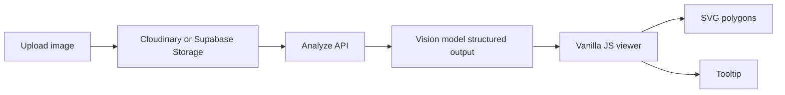

# Floor plan viewer (Vite + vanilla JS)

Implements the **Production floor-plan viewer** plan: **Vite**, **vanilla ES modules**, **plain CSS** (no Tailwind/React/TS required), **SVG** overlay with a pixel-based `viewBox="0 0 naturalWidth naturalHeight"` while JSON stays normalized `0–1`, **letterbox-aware** pointer mapping + **ray-casting** hit tests ([`src/lib/geometry.js`](src/lib/geometry.js)), zoom/pan/fullscreen, premium tooltip.

## Quick start

```bash
npm install
npm start
```

Open `http://127.0.0.1:5173`. **Load sample JSON** loads [`public/fixtures/sample-plan.json`](public/fixtures/sample-plan.json) (rooms-only v1). **Open image** and pick a matching floor plan to see overlays line up.

Phase 2 sample (catalog + sprites): [`public/fixtures/sample-plan-phase2.json`](public/fixtures/sample-plan-phase2.json) — swap the fetch path in [`src/viewer/floorPlanViewer.js`](src/viewer/floorPlanViewer.js) or merge data as needed.

## Architecture



v1 focuses on **rooms**; the editable **furniture** layer is composed when `furniture` / `furniture_catalog` exist in JSON. Use **Export JSON** after moving/replacing furniture to download the current edited analysis.

## Layout (plan)

| Path | Role |
|------|------|
| [`src/main.js`](src/main.js) | Bootstrap |
| [`src/viewer/floorPlanViewer.js`](src/viewer/floorPlanViewer.js) | State, pan/zoom, ray-cast hover |
| [`src/viewer/roomOverlay.js`](src/viewer/roomOverlay.js) | Room polygons |
| [`src/viewer/furnitureLayer.js`](src/viewer/furnitureLayer.js) | Phase 2 sprites |
| [`src/viewer/tooltip.js`](src/viewer/tooltip.js) | Tooltip copy |
| [`src/viewer/toolbar.js`](src/viewer/toolbar.js) | Toolbar UI |
| [`src/upload/uploadDropzone.js`](src/upload/uploadDropzone.js) | File input wiring |
| [`src/lib/coordinates.js`](src/lib/coordinates.js) | Letterbox → normalized |
| [`src/lib/geometry.js`](src/lib/geometry.js) | `pointInPolygon`, bbox |
| [`src/services/supabase.js`](src/services/supabase.js) | Storage upload (optional) |
| [`supabase/migrations/`](supabase/migrations/) | `furniture_catalog`, `floor_plans` |

Copy [`.env.example`](.env.example) to `.env` to show **Upload plan (Supabase)** (requires bucket `floor-plans`). **Cloudinary** can stay optional (see migration `002`).

## Vision (Google Gemini)

After **Open image**, the app calls **Gemini vision** via Flask `/api/analyze`.

1. Copy [`.env.example`](.env.example) to `.env` and set `GEMINI_API_KEY` from [Google AI Studio](https://aistudio.google.com/apikey).
2. Optional: `GEMINI_MODEL` (default `gemini-3-flash-preview`).
3. Run `npm start`. Flask serves the UI and analyze API on `http://127.0.0.1:5173`.

Use **Analyze LLM** to re-run extraction on the current file without re-uploading.

Health check: `GET http://127.0.0.1:5173/api/health`

See [`app.py`](app.py).

## Build

```bash
npm run build
npm run preview
```
